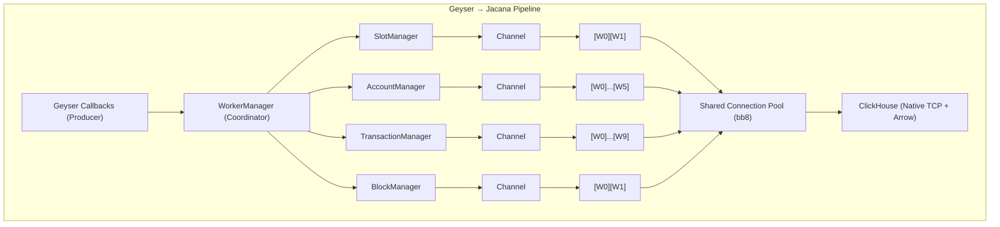

# Jacana

**A high-throughput Solana Geyser plugin for ClickHouse indexing using Apache Arrow columnar format over native TCP.**

Jacana eliminates the serialization overhead and row-wise conversion tax of traditional indexers by streaming Apache Arrow columnar batches directly to ClickHouse over the native binary protocol (port 9000). This architecture delivers sustained high throughput with predictable low latency.

## Architecture

### Design Pattern: Staged Event-Driven Architecture (SEDA)

Jacana implements a multi-stage pipeline with isolated worker pools.



**Key Patterns:**
- **Manager-Worker (Boss-Worker)**: Each entity type has a manager coordinating multiple workers
- **Producer-Consumer**: Bounded channels with backpressure handling
- **Bulkhead**: Independent failure domains per entity type
- **Batching/Aggregation**: Memory-efficient columnar batching before flush
- **Resource Pool**: Shared connection pool prevents connection explosion

**High-Performance Channels:**

Jacana uses [Kanal](https://github.com/fereidani/kanal) for inter-thread communication, providing:
- **Zero-allocation fast path**: For small messages (≤ pointer size), data is encoded directly in the pointer
- **Stack-to-stack transfers**: For larger messages, direct memory copying eliminates heap allocations
- **Optimized locking**: Specially tuned mutex designed for predictable channel lock times
- **Bounded channels with backpressure**: Configurable buffer sizes prevent memory exhaustion

Kanal's efficiency is critical for Jacana's throughput, enabling millions of messages per second between Geyser callbacks and worker threads with minimal overhead.

### Why This Architecture Outperforms Traditional Indexers

**1. Columnar Format End-to-End**

Traditional pipeline:
```
Geyser → JSON/Protobuf → Row objects → Deserialize → Re-columnize → Insert
```

Jacana pipeline:
```
Geyser → Arrow columnar batch → Stream to ClickHouse
```

**Benefits:**
- **Zero intermediate serialization**: No JSON encoding, no Protobuf schemas, no per-row object allocation
- **Contiguous memory layout**: Arrow arrays are cache-friendly with predictable access patterns
- **Vectorized operations**: ClickHouse consumes columnar data natively, enabling SIMD optimizations
- **Schema fidelity**: DDL exactly mirrors Arrow schema (e.g., `FixedString(32)`, `Array(UInt64)`), eliminating type coercion overhead

**2. Native TCP Protocol**

The ClickHouse native binary protocol (port 9000) has significantly less overhead than HTTP/gRPC:
- **Minimal framing**: No HTTP/2 multiplexing overhead, no RPC dispatch machinery
- **Protocol-level compression**: LZ4/ZSTD at transport layer, ~70% bandwidth reduction
- **Lower CPU cost**: Benchmarks show 4× throughput improvement vs gRPC with compression enabled for numeric-heavy workloads

**3. Intelligent Batching**

Workers accumulate items in memory-efficient buffers with triple trigger conditions:
- **max_rows**: Flush when row count limit reached (throughput optimization)
- **max_bytes**: Flush when memory limit reached (memory safety)
- **flush_ms**: Flush when time interval expired (latency guarantee)

This provides:
- **Amortized syscall cost**: Single insert for thousands of rows
- **Tunable latency**: Configure `flush_ms` (5-500ms) for your p99 requirements
- **Burst handling**: Large batches during high load, time-based flush during idle periods

**4. Parallel Insertion with Isolated Failure Domains**

Each entity type (accounts, transactions, slots, blocks) has:
- Independent worker pool (configurable count)
- Separate bounded channels (backpressure per entity)
- Isolated error handling (one entity type failure doesn't cascade)

This enables:
- **Workload-proportional scaling**: More workers for high-volume entities
- **Graceful degradation**: Continue indexing other entities if one fails
- **Independent monitoring**: Per-entity metrics and health checks

## Features

**Backpressure Handling**:
- Bounded channels with configurable buffer sizes
- Graceful degradation on full channels (logged drops)
- Try-send semantics to prevent validator blocking

**Failure Recovery**:
- Per-worker circuit breakers (max consecutive errors)
- Health checks every 30 seconds
- Automatic worker shutdown on persistent failures
- Connection pool handles reconnection transparently

**Shutdown**:
- Graceful shutdown flushes all buffered data
- Coordinated worker termination with timeout
- Final health check before process exit

## Performance Characteristics

### Throughput

**Expected sustained rates** (single validator node):
- **Transactions**: 1M+ rows/s with 10 workers
- **Accounts**: 500K+ rows/s with 6 workers
- **Slots**: 50K+ rows/s with 2 workers
- **Blocks**: 20K+ rows/s with 2 workers

Actual throughput depends on:
- ClickHouse cluster write capacity
- Network bandwidth and latency
- Batch size configuration
- Account data size (for accounts entity)

### Latency

**End-to-end latency** (Geyser callback → row visible in ClickHouse):
- **p50**: 50-100ms (typical flush interval)
- **p95**: 150-300ms (depends on batch accumulation)
- **p99**: 500ms-2s (includes occasional backpressure and connection acquisition)

Tune `flush_ms` to control latency-throughput tradeoff:
- **Low latency** (5-20ms): Near real-time, lower batch efficiency
- **High throughput** (100-500ms): Larger batches, increased tail latency

### Comparison: Jacana vs Traditional Indexers

| Metric | Jacana (Arrow + TCP) | gRPC + Protobuf → Postgres | HTTP + JSON → Database |
|--------|---------------------|----------------------------|------------------------|
| Serialization cost | **Zero** (columnar in-memory) | Moderate (Protobuf encode/decode) | High (JSON stringify/parse) |
| Protocol overhead | **Minimal** (native binary) | Medium (HTTP/2 framing + RPC) | High (HTTP headers, text protocol) |
| Type conversions | **Zero** (schema match) | 1-2 hops (Protobuf → SQL types) | 2-3 hops (JSON → objects → SQL) |
| Compression | **Protocol-level** (LZ4/ZSTD) | Application-level (optional) | Application-level (optional) |
| Throughput | **1M+ rows/s** | 200-500K rows/s | 50-200K rows/s |
| Memory efficiency | **High** (columnar batching) | Medium (row buffers) | Low (string manipulation) |
| CPU usage | **Low** (I/O bound) | Medium (serialization) | High (parsing + serialization) |
| Latency (p99) | **Sub-second** with tuning | 1-5 seconds | 5-15 seconds |

**Key advantage**: By eliminating serialization hops and using ClickHouse's native protocol, Jacana achieves **5-10× throughput** with **50-70% lower memory** usage compared to traditional row-wise indexers.

## Configuration

### Configuration Parameters

#### Top-Level Settings

| Parameter | Type | Description | Default | Recommendation |
|-----------|------|-------------|---------|----------------|
| `libpath` | string | Path to compiled plugin library | *required* | Use absolute path for production |
| `starting_slot` | u64 | First slot to process | `0` | Set to current slot to skip historical data |
| `log_level` | string | Log level: `error`, `warn`, `info`, `debug`, `trace` | `"info"` | Use `info` for production, `debug` for troubleshooting |
| `runtime_threads` | usize | Tokio runtime worker threads for async coordination | `4` | **8-16** for high-throughput production setups |

**About `runtime_threads`**: 
These threads handle async operations: channel coordination, geyser callbacks, connection pool management. They are **separate from entity worker threads** configured in `batch.*.workers`. Increase if you see "channel full" warnings or callback timeouts.

**Formula**: `runtime_threads = min(num_cpus / 2, 16)` is a good starting point.

#### Connection Settings

| Parameter | Type | Description | Default | Production Value |
|-----------|------|-------------|---------|------------------|
| `host` | string | ClickHouse server hostname/IP | `"localhost"` | Your CH server IP |
| `port` | u16 | Native protocol port (not HTTP) | `9000` | `9000` (standard native protocol port) |
| `database` | string | Target database name | `"default"` | `"geyser"` or your DB name |
| `username` | string | ClickHouse username | `"default"` | Your CH user |
| `password` | string | ClickHouse password | `""` | **Use strong password** |
| `compression` | enum | Transport compression: `"none"`, `"lz4"`, `"zstd"` | `"lz4"` | **`"lz4"`** for best throughput/CPU balance |
| `validate_schemas` | bool | Validate table schemas on startup | `true` | **`true`** to catch schema mismatches early |

**Compression recommendations**:
- **LZ4**: Fast compression, ~70% size reduction, minimal CPU overhead (recommended)
- **ZSTD**: Better compression (~80% reduction), higher CPU cost
- **None**: Only for local testing or very fast networks

#### Connection Pool Settings

| Parameter | Type | Description | Default | High-Throughput Recommendation |
|-----------|------|-------------|---------|-------------------------------|
| `max_size` | u32 | Maximum concurrent connections | `25` | **40-50** (scale with total workers) |
| `min_idle` | u32? | Minimum idle connections to maintain | `8` | **10-15** (fast cold starts) |
| `connection_timeout_ms` | u64 | Max time to establish new connection | `30000` | `30000` (30s is reasonable) |
| `idle_timeout_ms` | u64? | Recycle idle connections after | `600000` | `600000` (10 min) |
| `max_lifetime_ms` | u64? | Force recycle after this duration | `1800000` | `1800000` (30 min, prevents stale connections) |
| `acquire_timeout_ms` | u64 | Max wait for available connection | `15000` | `15000-30000` |
| `test_on_check_out` | bool | Health check each connection acquisition | `false` | **`false`** (performance), `true` (safety) |

**Pool sizing formula**: `max_size ≥ total_workers * 1.5`

Example: 20 total workers → `max_size = 30-40`

#### Channel Buffer Settings

| Parameter | Type | Description | Default | Recommendation |
|-----------|------|-------------|---------|----------------|
| `slots` | usize | Slot update channel capacity | `10000` | **10000** (sufficient for most validators) |
| `blocks` | usize | Block metadata channel capacity | `10000` | **10000** |
| `transactions` | usize | Transaction channel capacity | `50000` | **50000-100000** (high volume) |
| `accounts` | usize | Account update channel capacity | `100000` | **100000-200000** (depends on filters) |

**Tuning**: Increase if you see "channel at capacity" warnings. Larger buffers smooth out burst traffic but increase memory usage.

**Memory impact**: Each slot/block ~1KB, transaction ~2KB, account ~5-50KB (depends on data size).

#### Arrow Settings

| Parameter | Type | Description | Default | Recommendation |
|-----------|------|-------------|---------|----------------|
| `batch_size` | usize | Target Arrow RecordBatch size | `16384` | **16384** (sweet spot for most workloads) |
| `memory_limit_mb` | usize | Arrow memory pool limit | `512` | **512-1024MB** |

**About `batch_size`**: This is a hint for initial buffer allocation. Actual batch sizes are controlled by `batch.*.max_rows`.

#### Filter Settings

**Transaction Filters**:

```json
"transactions": {
  "mentions": ["*"],          // "*" = all, or list of base58 pubkeys
  "exclude_votes": true       // Exclude vote transactions when mentions = "*"
}
```

- **All transactions**: `"mentions": ["*"]`
- **Exclude votes**: Add `"exclude_votes": true`
- **Specific pubkeys**: `"mentions": ["PubkeyBase58..."]`
- **Vote transactions only**: `"mentions": ["all_votes"]`
- **Disabled**: `"mentions": []`

**Account Filters**:

```json
"accounts": {
  "addresses": ["*"],         // "*" = all, or list of base58 pubkeys
  "programs": ["*"]           // "*" = all, or list of program pubkeys
}
```

- **All accounts**: `"addresses": ["*"]` or `"programs": ["*"]`
- **Specific addresses**: `"addresses": ["AddressBase58..."]`
- **By program owner**: `"programs": ["ProgramBase58..."]`
- **Combined**: OR logic (match if address OR program matches)
- **Disabled**: Both empty arrays

#### Batch Policy Settings

Each entity type has independent batch configuration:

```json
"batch": {
  "entity_type": {
    "max_rows": 60000,       // Flush when this many items accumulated
    "max_bytes": 33554432,   // Flush when this much memory used (32MB)
    "flush_ms": 1500,        // Flush after this interval (milliseconds)
    "workers": 10            // Number of parallel workers for this entity
  }
}
```

**Tuning Guidelines**:

| Entity | Typical Volume | Recommended Workers | Recommended max_rows | Recommended flush_ms |
|--------|---------------|---------------------|----------------------|---------------------|
| **Transactions** | Very High | **8-12** | 50000-100000 | 1000-2000ms |
| **Accounts** | High | **4-8** | 50000-100000 | 1000-2000ms |
| **Slots** | Medium | **1-2** | 1000-5000 | 300-1000ms |
| **Blocks** | Low | **1-2** | 500-2000 | 300-1000ms |

**General Rules**:
1. **max_rows**: Balance batch size (throughput) vs memory usage
2. **max_bytes**: Safety limit to prevent OOM (typically 32-64MB per worker)
3. **flush_ms**: Controls latency (lower = faster visibility, less efficient)
4. **workers**: Scale with volume and ClickHouse write capacity

**Worker count formula**: 
- Start with workload proportions: transactions (highest) > accounts > slots/blocks
- Scale total workers based on ClickHouse cluster capacity
- Monitor "channel at capacity" logs and adjust

**High-Throughput Production Config**:

```json
"batch": {
  "accounts": {
    "max_rows": 75000,
    "max_bytes": 67108864,
    "flush_ms": 1500,
    "workers": 8
  },
  "transactions": {
    "max_rows": 100000,
    "max_bytes": 67108864,
    "flush_ms": 1500,
    "workers": 12
  },
  "slots": {
    "max_rows": 5000,
    "max_bytes": 2097152,
    "flush_ms": 500,
    "workers": 2
  },
  "blocks": {
    "max_rows": 2000,
    "max_bytes": 4194304,
    "flush_ms": 500,
    "workers": 2
  }
}
```

With this config:
- **Total workers**: 24 (12 + 8 + 2 + 2)
- **Connection pool**: `max_size: 50`
- **Runtime threads**: `12-16`
- **Expected throughput**: 1M+ transactions/s, 500K+ accounts/s

## Database Schema

Jacana expects the following ClickHouse tables. See `migrations/` directory for complete DDL.

### Accounts Table

```sql
CREATE TABLE account (
    pubkey FixedString(32),
    owner FixedString(32),
    slot UInt64,
    lamports UInt64,
    executable Bool,
    rent_epoch UInt64,
    data String,                -- Base64-encoded account data
    write_version UInt64,
    updated_at DateTime64(3) DEFAULT now64(3)
) ENGINE = ReplacingMergeTree(write_version)
ORDER BY (pubkey, slot)
PARTITION BY intDiv(slot, 10000000);
```

### Transactions Table

```sql
CREATE TABLE transaction (
    signature FixedString(64),
    slot UInt64,
    tx_index UInt64,
    is_vote Bool,
    message_type UInt8,         -- 0 = Legacy, 1 = V0
    success Bool,
    fee UInt64,
    updated_at DateTime64(3) DEFAULT now64(3),
    -- Nested balance changes (flattened as parallel arrays)
    balance_changes Nested (
        account FixedString(32),
        account_index UInt16,
        pre_balance UInt64,
        post_balance UInt64,
        updated_at DateTime64(3)
    )
) ENGINE = ReplacingMergeTree(updated_at)
ORDER BY (slot, tx_index)
PARTITION BY intDiv(slot, 1000000);
```

### Slots Table

```sql
CREATE TABLE slot (
    slot UInt64,
    parent Nullable(UInt64),
    status Enum8(
        'processed' = 1,
        'confirmed' = 2,
        'rooted' = 3,
        'first_shred_received' = 4,
        'completed' = 5,
        'created_bank' = 6,
        'dead' = 7
    ),
    updated_at DateTime64(3) DEFAULT now64(3)
) ENGINE = ReplacingMergeTree(updated_at)
ORDER BY slot
PARTITION BY intDiv(slot, 1000000);
```

### Blocks Table

```sql
CREATE TABLE block (
    slot UInt64,
    blockhash String,
    block_time Nullable(DateTime64(3)),
    block_height Nullable(UInt64),
    parent_slot UInt64,
    rewards_pubkey Array(FixedString(32)),
    rewards_lamports Array(Int64),
    rewards_post_balance Array(Int64),
    rewards_reward_type Array(Nullable(Enum8('Unknown' = 0, 'Fee' = 1, 'Rent' = 2, 'Staking' = 3, 'Voting' = 4))),
    rewards_commission Array(Nullable(Int16)),
    updated_at DateTime64(3) DEFAULT now64(3)
) ENGINE = ReplacingMergeTree(updated_at)
ORDER BY slot
PARTITION BY intDiv(slot, 1000000);
```

**Schema Notes**:
- `FixedString(N)` for binary data (pubkeys, signatures) - matches Arrow binary format
- `DateTime64(3)` for millisecond-precision timestamps with automatic default
- `ReplacingMergeTree` engine for automatic deduplication on merge (using `updated_at` or `write_version`)
- Partitioning by slot ranges for efficient data management and querying
- Nested columns (transactions) or parallel arrays (blocks) for one-to-many relationships
- Bloom filter index on transaction signatures for fast lookup

**Bonus**: The migrations include a `balance_change` view that flattens the nested balance changes for easier querying:

```sql
CREATE VIEW balance_change AS
SELECT
    signature,
    slot,
    tx_index,
    balance_changes.account AS account,
    balance_changes.account_index AS account_index,
    balance_changes.pre_balance AS pre_balance,
    balance_changes.post_balance AS post_balance,
    balance_changes.updated_at AS updated_at
FROM geyser.transaction
ARRAY JOIN balance_changes;
```

## Database Setup

Jacana uses [goose](https://github.com/pressly/goose) for database migrations. A `justfile` is provided for convenience:

```bash
# Install goose (if needed)
go install github.com/pressly/goose/v3/cmd/goose@latest

# Configure your ClickHouse connection
export CLICKHOUSE_URL='clickhouse://localhost:9000/default?username=default&password=P%40ssword'

# Apply all migrations
just migrate-up

# Check migration status
just migrate-status

# Rollback last migration
just migrate-down

# Create new migration
just migrate-create my_new_migration
```


## Roadmap

- [ ] **Metrics & Observability**: Prometheus/OpenTelemetry integration for production monitoring
- [ ] **TLS Support**: Full TLS testing and documentation

## License

Apache-2.0

## Contributing

Contributions welcome! Please open an issue or pull request.

## Support

For issues, questions, or feature requests, please open a GitHub issue.
